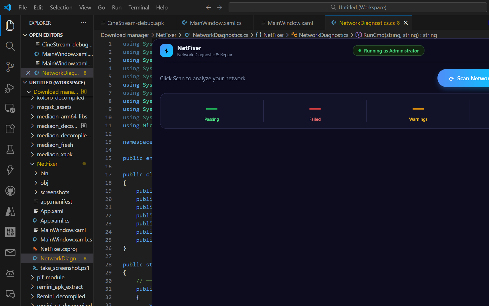
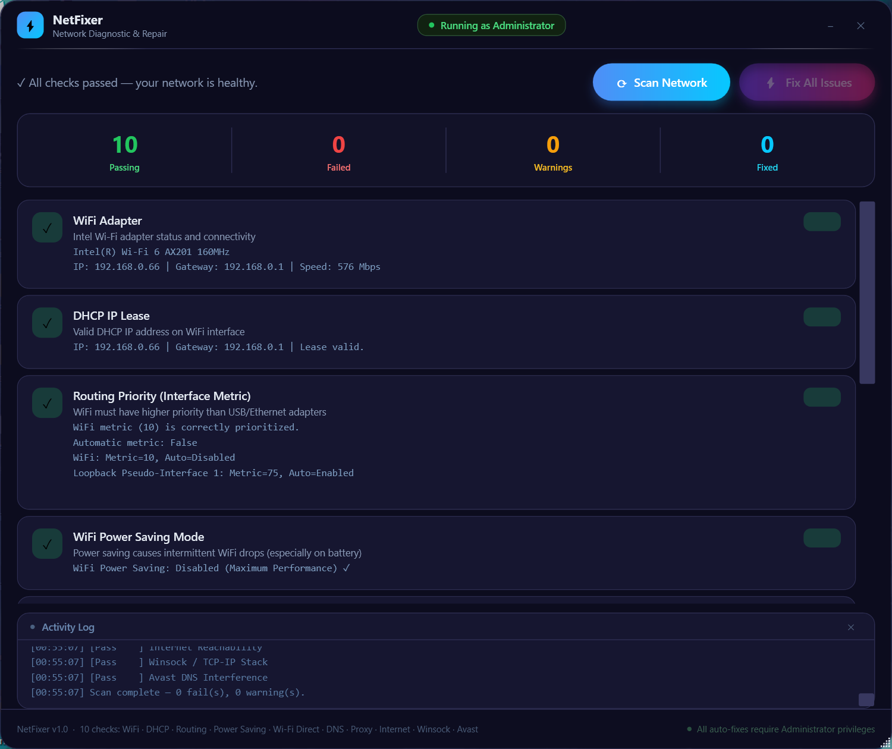

# ⚡ NetFixer — Free Windows Network Diagnostic & Auto-Repair Tool

> **Fix WiFi, DNS, Winsock, Proxy, DHCP & more — automatically. No installation. 64 KB. Instant.**

<p align="center">
  <a href="https://d13056.github.io/NetFixer/">
    
  </a>
</p>

<p align="center">
  <a href="https://github.com/D13056/NetFixer/releases/download/v1.0.0/NetFixer.exe">
    
  </a>
  <a href="https://d13056.github.io/NetFixer/">
    
  </a>
  <a href="https://github.com/D13056/NetFixer/stargazers">
    
  </a>
  <a href="https://github.com/D13056/NetFixer/releases">
    
  </a>
</p>

<p align="center">
  
  
  
  
  
  
  
</p>

---

**NetFixer** is a free, portable Windows tool that **automatically diagnoses and repairs internet connection problems** on Windows 10 and Windows 11. If your WiFi is connected but there's no internet, DNS isn't resolving, your IP address shows 169.254.x.x, websites won't load, or your network randomly drops — NetFixer finds the root cause and fixes it in seconds.

No installation. No bloatware. Just a single **64 KB EXE** that runs instantly on any Windows 10/11 PC.

---

## 📸 Screenshots

<p align="center">
  
  
</p>

---

## 🚨 Does NetFixer solve your problem?

If you're experiencing any of the following on Windows 10 or Windows 11 — **NetFixer will diagnose and fix it automatically**:

- ❌ WiFi connected but no internet access
- ❌ DNS server not responding / DNS resolution failing
- ❌ IP address showing 169.254.x.x (APIPA / DHCP failure)
- ❌ Internet randomly disconnects and reconnects
- ❌ Websites not loading but ping works
- ❌ USB tethering overrides WiFi and breaks routing
- ❌ Slow internet after Windows Update
- ❌ Winsock corruption / `netsh winsock reset` needed
- ❌ Proxy settings blocking internet access
- ❌ Avast / antivirus blocking DNS queries
- ❌ WiFi keeps disconnecting on battery
- ❌ Wi-Fi Direct adapter causing NDIS conflicts
- ❌ No internet after VPN disconnect

---

## ✨ Why NetFixer?

| Feature | NetFixer | Manual CMD Fix | Other Tools |
|---------|----------|---------------|-------------|
| No installation | ✅ | ✅ | ❌ Usually requires install |
| File size | **64 KB** | N/A | 10–200 MB |
| Startup time | **< 1 second** | N/A | Several seconds |
| Auto-fix with one click | ✅ | ❌ Manual commands | ⚠️ Some |
| 10 checks in one scan | ✅ | ❌ One at a time | ⚠️ Some |
| Works offline | ✅ | ✅ | ❌ Often requires internet |
| Premium UI | ✅ Dark WPF | ❌ CMD window | ⚠️ Basic |
| Free & open source | ✅ MIT | ✅ | ❌ Often paid |

---

## 🔍 10 Automated Diagnostic Checks

| # | Problem Detected | How It's Fixed |
|---|-----------------|----------------|
| 1 | **WiFi Adapter Down** — adapter disabled or no IP/gateway | Re-enables adapter, reports link speed |
| 2 | **DHCP Failure** — IP shows 169.254.x.x (APIPA address) | `ipconfig /release` then `/renew` |
| 3 | **Wrong Routing Priority** — USB tethering metric beats WiFi | Sets WiFi metric=10, USB=100, disables AutomaticMetric |
| 4 | **WiFi Power Saving** — adapter turns off on battery | Sets Maximum Performance power plan via `powercfg` |
| 5 | **Wi-Fi Direct Conflict** — virtual adapter causing NDIS Event 74 | Disables all Wi-Fi Direct virtual adapters |
| 6 | **DNS Not Resolving** — `google.com` lookup fails or times out | Sets Google public DNS: 8.8.8.8 / 8.8.4.4 |
| 7 | **Proxy Misconfigured** — system proxy set but unreachable | Disables proxy in registry, resets WinHTTP |
| 8 | **No Internet Reachability** — ping and HTTPS both fail | Full network stack reset (winsock + ip + flush) |
| 9 | **Winsock Corrupted** — catalog has fewer than 10 entries | `netsh winsock reset` + `netsh int ip reset` |
| 10 | **Antivirus DNS Block** — Avast Web Shield causing DNS timeouts | Flush DNS cache, restart DNS Client service |

---

## 🚀 Download & Run (30 seconds)

### ⬇️ [Download NetFixer.exe — Free, 64 KB](https://github.com/D13056/NetFixer/releases/download/v1.0.0/NetFixer.exe)

1. Download `NetFixer.exe` above
2. Right-click → **Run as administrator** (or Windows will auto-prompt)
3. Click **⚡ Scan Network**
4. Click **Fix All Issues**
5. Done — your network issues are resolved

> **Works on:** Windows 10 (all versions) · Windows 11 · x64

---

## 🔧 How It Works

```
[Scan Network]
      │
      ├─► Check WiFi Adapter ──────────► PASS / FAIL + auto-fix available
      ├─► Check DHCP Lease ────────────► PASS / FAIL + auto-fix available
      ├─► Check Interface Metric ──────► PASS / WARN + auto-fix available
      ├─► Check WiFi Power Saving ─────► PASS / WARN + auto-fix available
      ├─► Check Wi-Fi Direct Adapter ──► PASS / WARN + auto-fix available
      ├─► Check DNS Resolution ────────► PASS / FAIL + auto-fix available
      ├─► Check Proxy Settings ────────► PASS / FAIL + auto-fix available
      ├─► Check Internet Reachability ─► PASS / FAIL + auto-fix available
      ├─► Check Winsock Integrity ─────► PASS / FAIL + auto-fix available
      └─► Check Antivirus Interference ► PASS / WARN + auto-fix available
                │
         [Fix All Issues] ──► Applies all available fixes sequentially
```

---

## 🛠 Build from Source

```powershell
git clone https://github.com/D13056/NetFixer.git
cd NetFixer
dotnet build -c Release
# Output: bin\Release\net48\NetFixer.exe  (~64 KB)
```

**Requirements to build:** [.NET 8 SDK](https://dotnet.microsoft.com/download) · Windows 10/11 x64  
**Requirements to run:** Windows 10/11 with .NET Framework 4.8 (pre-installed on all modern Windows — no download needed)

---

## 📋 System Requirements

| | |
|---|---|
| **OS** | Windows 10 / Windows 11 (x64) |
| **Runtime** | .NET Framework 4.8 — already installed on Windows 10 v1903+ and all Windows 11 |
| **Privileges** | Administrator — auto-requested via UAC on launch |
| **Disk space** | 64 KB |
| **RAM** | < 30 MB |
| **Dependencies** | None |

---

## ❓ Frequently Asked Questions

**Q: Is NetFixer safe? Does it change system settings permanently?**  
A: Yes, it's safe and open source — you can read every line of code here. Most fixes (DNS, proxy, power saving) are fully reversible. Interface metric and winsock reset are permanent but standard Windows operations.

**Q: Why does it need Administrator?**  
A: Fixing network adapters, routing tables, DNS settings, Winsock, and power plans all require elevated OS permissions. NetFixer requests this automatically via UAC.

**Q: My WiFi shows "Connected" but I have no internet — will this fix it?**  
A: Yes. This is the most common scenario NetFixer is built for. It checks DHCP, DNS, routing, proxy, and internet reachability in sequence and fixes each layer.

**Q: Does it work with Ethernet too?**  
A: The DNS, proxy, Winsock, and internet reachability checks work for all connection types. The WiFi-specific checks (power saving, Wi-Fi Direct) are WiFi-only.

**Q: Will it break anything?**  
A: No. All fixes are standard Windows recovery operations (the same ones Microsoft's own troubleshooter performs). Winsock and IP resets require a reboot to fully take effect.

**Q: Does it work on Windows 7/8?**  
A: NetFixer targets Windows 10/11 with .NET Framework 4.8. It may run on Windows 8.1 with .NET 4.8 installed but is not tested.

**Q: Is it really only 64 KB?**  
A: Yes. By targeting .NET Framework 4.8 (which is pre-installed on all Windows 10/11 machines), there's no runtime to bundle. The EXE contains only the app's own code.

---

## 🐛 Known Issues

- **Avast check** — only triggers if Avast service is running AND DNS timeout events exist in the last 24 hours (prevents false positives from old logs)
- **Winsock / IP reset** — requires reboot to fully apply; NetFixer will inform you
- **Wi-Fi Direct** — fix disables adapter at OS level; re-enable via Device Manager if a Wi-Fi Direct feature stops working

---

## 🤝 Contributing

Contributions are welcome! See [CONTRIBUTING.md](CONTRIBUTING.md) for guidelines.

Ideas for new checks:
- IPv6 connectivity test
- MTU / packet fragmentation detection
- VPN adapter conflict detection
- Windows Firewall rules inspection
- Network driver version check

---

## 📁 Project Structure

```
NetFixer/
├── app.manifest              # UAC requireAdministrator
├── NetFixer.csproj           # .NET Framework 4.8 WPF project
├── App.xaml / App.xaml.cs    # Application entry point
├── MainWindow.xaml           # Premium dark WPF UI
├── MainWindow.xaml.cs        # Code-behind + 5 value converters
├── NetworkDiagnostics.cs     # 10 diagnostic checks + auto-fix engine
└── screenshots/
    ├── main_window.png
    └── after_scan.png
```

---

## ⭐ Support the Project

If NetFixer fixed your internet problem, please **star this repository** — it helps others find it when they search for Windows network repair tools.

[](https://star-history.com/#D13056/NetFixer)

---

## 📄 License

MIT License — free to use, modify, and redistribute. See [LICENSE](LICENSE).

---

<p align="center">
  <strong>NetFixer</strong> — Windows Network Repair Tool · C# WPF · .NET Framework 4.8 · Free & Open Source<br/>
  <em>Fix WiFi · Fix DNS · Fix Winsock · Fix DHCP · Fix Proxy · Fix Routing — all in one click</em>
</p>
